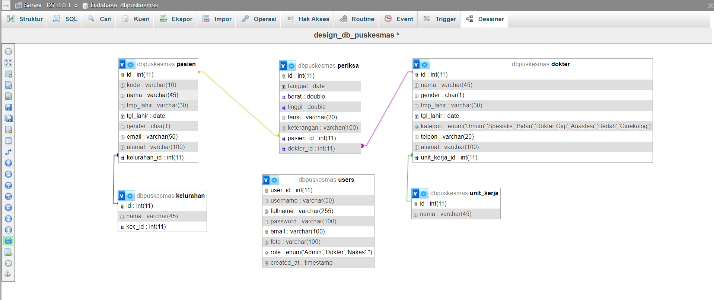

### Identitas Pemilik Tugas:

- **Nama**: Eko Muchamad Haryono
- **NIM**: 0110223079
- **Kelas**: TI-02
- **Semester**: 2
- **Mata kuliah**: Pemrograman Web 2
- **Nama Dosen**: Dr. Sirojul Munir, S.Si., M.Kom
- **Tujuan Tugas**: Sebagai Tugas Project 01 Atau Pertama Saat Semester 2, Mata Kuliah Pemrograman Web 2 Sebagai Penilaian UTS
- **Hosting Kampus**: https://kreasi.nurulfikri.ac.id/ekom23079ti/puskesmas-personal-project-01-pemweb-2-10may/
- **Post Linkedin**: [Link Post](https://www.linkedin.com/posts/eko-haryono-290_presentasi-puskesmas-berbasis-web-project-activity-7193501122496520193-_P0u?utm_source=share&utm_medium=member_desktop)

# Aplikasi Puskesmas Sederhana Berbasis Web dengan Teknologi Utama PHP, MySQL, dan AdminLTE

#### Design Database/ERD

#### Landing Page

#### Halaman Admin

#### Halaman Login

## Deskripsi

Project ini bertujuan untuk membuat aplikasi CRUD sederhana. Aplikasi ini menggunakan teknologi PHP, MySQL, dan AdminLTE. Terdapat enam (6) tabel yang akan diolah, yaitu users, pasien, dokter, periksa, unit kerja & kelurahan.

### Link Project 01 -> 10 Mei

1. [Project 01 - 10 Mei - Aplikasi CRUD Sederhana Puskesmas
   ](https://github.com/ekomh170/Project-1-PemWeb-2-10May.git)

## Penjelasan Fitur Yang Ada Di Aplikasi Puskesmas

1. **Landing Page - Puskesmas**
   Untuk Menampilkan Informasi Layanan, Tentang, Kegiatan, Dokter, Jadwal Yang Bersifat Seharusnya Dapat Dilihat Oleh Masyarakat Umum

2. **Auth (Login) - Login Petugas Puskesmas**:
   Untuk masuk ke dalam sistem pengelolaan data di Puskesmas, petugas harus melewati proses autentikasi yang telah disebutkan sebelumnya. Setelah berhasil login, petugas akan diarahkan ke antarmuka atau aplikasi yang memungkinkan mereka untuk mengakses dan mengelola data tersebut.

 ##### Halaman Panel Admin :

0. Halaman Panel Admin Tervalidasi Ketika Users Belum Login Akan Di Lempar Kehalaman Login Untuk Login Terlebih Dahulu

3. **Dashboard Informasi**:
   Untuk Menampilkan Informasi Penting Seperti Jumlah Data Pada Setiap Menu & Menampilkan Informasi Data Pemeriksaan Pasien Yang Terburu Setiap Di Input.

4. **Profile Kreator**:
   Menu Tambahan Identitas Sang Kreator Aplikasi CRUD Sederhana Puskesmas

5. **Menu Dokter**:
   - Buat tampilan CRUD untuk dokter yang mencakup:
     - Menampilkan daftar dokter.
     - Menambahkan data dokter baru.
     - Mengedit data dokter yang sudah ada.
     - Menghapus data dokter.

6. **Menu Pasien**:
   - Buat tampilan CRUD untuk pasien yang mencakup:
     - Menampilkan daftar pasien.
     - Menambahkan data pasien baru.
     - Mengedit data pasien yang sudah ada.
     - Menghapus data pasien.

7. **Menu Kelurahan**:
   - Buat tampilan CRUD untuk kelurahan yang mencakup:
     - Menampilkan daftar kelurahan.
     - Menambahkan data kelurahan baru.
     - Mengedit data kelurahan yang sudah ada.
     - Menghapus Data Unit Kerja Yang Belum Berelasi Dengan Data Pasien

8. **Menu Unit Kerja**:
   - Buat tampilan CRUD untuk unit kerja yang mencakup:
     - Menampilkan daftar unit kerja.
     - Menambahkan data unit kerja baru.
     - Mengedit data unit kerja yang sudah ada.
     - Menghapus Data Unit Kerja Yang Belum Berelasi Dengan Data Dokter

##### Fitur Tambahan Di Luar Permintaan :

9. **Menu Users**:
- Buat tampilan CRUD untuk users yang mencakup:
     - Menampilkan daftar users.
     - Menambahkan data users baru.
     - Mengedit data users yang sudah ada.
     - Menghapus data users.
     - Upload Foto Users

10. **Profile Linkedin**:
   Untuk Menampilkan Tautan Linkedin Sang Pembuat : [Eko Muchamad Haryono Linkedin
   ](https://www.linkedin.com/in/eko-haryono-290)

11. **Profile Github**:
   Untuk Menampilkan Tautan Github Sang Pembuat : [Eko Muchamad Haryono Github
   ](https://github.com/ekomh170)

12. **Log-Out Fitur Pengelolaan Data/Admin Panel**:

## Tech Stack Yang Di Gunakan

- PHP
- MySQL
- AdminLTE
- Bootstrap
- JS
- Design Database (phpmyadmin)

## Informasi Tambahan Project 01

1. **Deadline**: 1 minggu setelah UTS Semester 2 - 10 Mei.
2. **Pengerjaan Individu**: Proyek ini akan dikerjakan secara individu.
